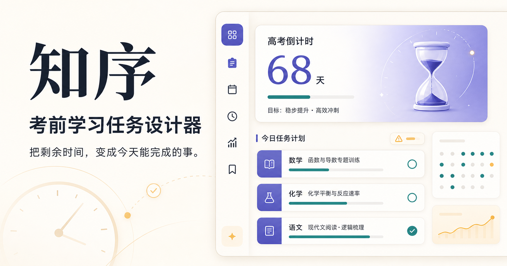

# 知序 · 考前学习任务设计器

> 为中小学生根据考试日期、每日学习时间和知识掌握程度，自动生成并动态调整考前复习计划。

🏆 **AIY 黑客松 2026 深圳站** 参赛作品

🏷️ 命题企业 / 赛道：**Coze · 高中组 · 考前学习任务设计器**

👤 团队：**ORDO**

🔢 团队编号：**HD0096**



🔗 **[在线体验：打开知序](https://zhixu-study-planner-2026.gaohuaxuan281.chatgpt.site/)**

---

## 👥 团队分工

| 成员 | GitHub | 负责内容 |
| --- | --- | --- |
| 高华轩 | [@gaohuaxuan281-alt](https://github.com/gaohuaxuan281-alt) | 代码框架、功能整合与整体开发 |
| 莫旨翘 | [@monm0101](https://github.com/monm0101) | 部分功能代码编写、PPT 制作 |
| 余倩西 | [@yqxcecilia-coder](https://github.com/yqxcecilia-coder) | 学习任务卡设计与制作 |
| 陈嘉滢 | [@Mary-cjy](https://github.com/Mary-cjy) | 部分功能代码编写 |

## ✨ 它能做什么

- **建立真实学习档案**：收集年级、科目、教材、考试日期、考试 Unit 范围、每日学习时段和补充限制。
- **进行 10 题诊断 Quiz**：根据考试范围生成诊断题，识别分科表现和薄弱知识点。
- **生成完整考前 Timeline**：从当天连续规划到考试前一天，并根据可用学习时段安排任务。
- **同步每日 Todo**：Todo 从最新 Timeline 派生，避免出现两套互相冲突的计划。
- **提供 AI Tutor**：结合学习档案、考试范围与诊断结果进行针对性答疑和练习。
- **形成动态反馈闭环**：记录每日反馈，生成待确认的调整建议；只有用户接受后才更新计划。
- **沉淀日志与进展洞察**：基于真实学习记录展示完成率、薄弱点、学习时长和计划变化。

## 🎬 演示

在线版本包含手机号注册登录、首次学习问卷、诊断 Quiz、Timeline、Todo、AI Tutor、日志、反馈总结、进展洞察和用户中心八个主要模块。

🔗 在线体验：<https://zhixu-study-planner-2026.gaohuaxuan281.chatgpt.site/>

> 业务页面需要使用中国大陆手机号注册并登录。会员充值目前仅为界面演示，不会产生真实扣款。

## 🛠️ 用到的技术 / AI 工具

- React 19、TypeScript
- Next.js App Router 兼容目录、vinext、Vite
- Cloudflare Sites、Cloudflare D1
- Drizzle ORM
- OpenAI Responses API 与 Structured Outputs
- GitHub、Codex

## 🚀 怎么跑起来

环境要求：Node.js `>= 22.13.0`。

```bash
npm install
cp .env.example .env.local
npm run dev
```

然后打开 <http://localhost:3000>。

如需使用 AI 功能，请由项目管理员在 `.env.local` 中配置服务端 `OPENAI_API_KEY`。真实密钥不得提交到 GitHub、日志、截图或聊天记录。

提交代码前运行：

```bash
npm run build
node --test tests/rendered-html.test.mjs
```

## 📁 项目结构

- `app/`：页面路由和服务端 API
- `features/`：首页、Timeline、Todo、AI Tutor、日志、反馈、洞察和用户中心模块
- `lib/`：认证、学习档案、诊断 Quiz、AI、计划与反馈领域服务
- `db/`、`drizzle/`：D1 数据表定义与迁移
- `components/`：公共产品壳层与全局组件
- `docs/`：架构、协作和仓库说明

## 📌 后续计划

- 增加新用户完整流程的 Playwright 端到端测试。
- 丰富长期备考阶段的任务多样性与个性化策略。
- 完善未成年人隐私、内容安全、短信验证和生产监控。
- 持续优化 Timeline、Todo、反馈和进展洞察之间的数据闭环。

---

## 📄 版权与许可

本作品版权归 **高华轩、莫旨翘、余倩西、陈嘉滢** 共同所有，采用 [MIT License](./LICENSE) 开源，使用请署名。

> 本项目为 AIY 黑客松参赛作品，作品归团队所有；AIY 组委会仅作收录与展示。
